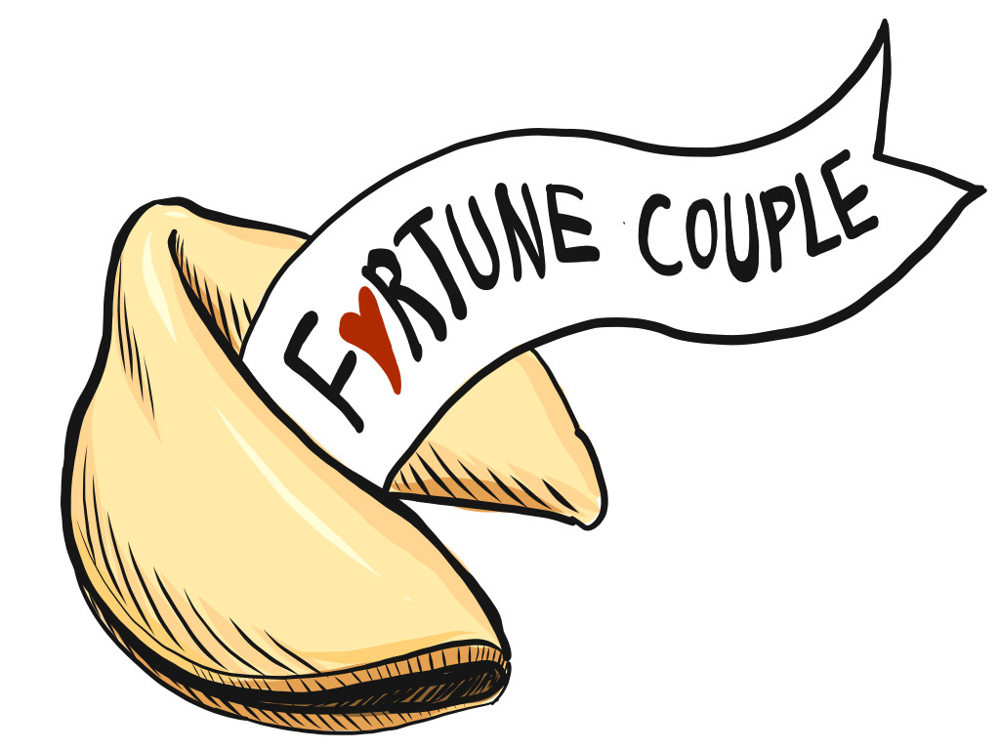
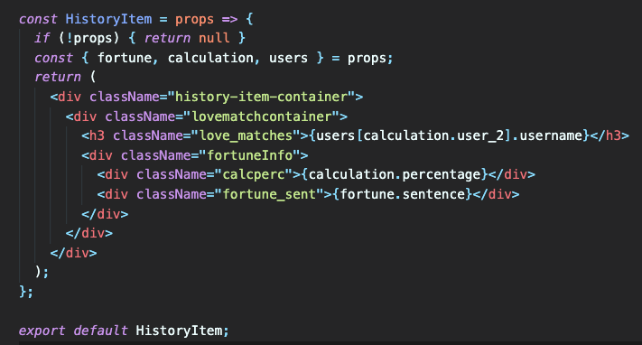
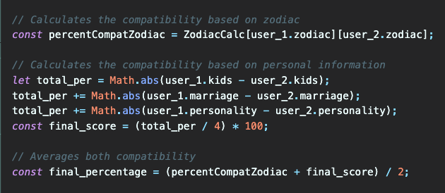
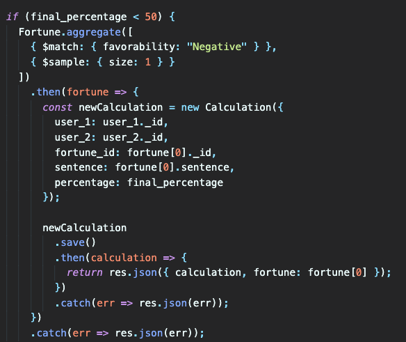
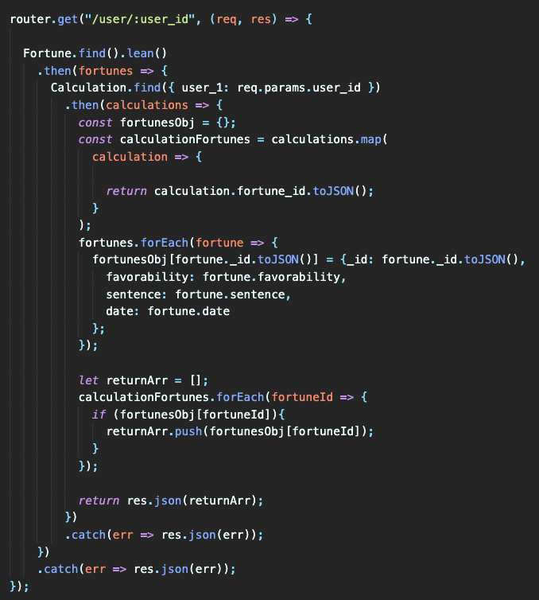
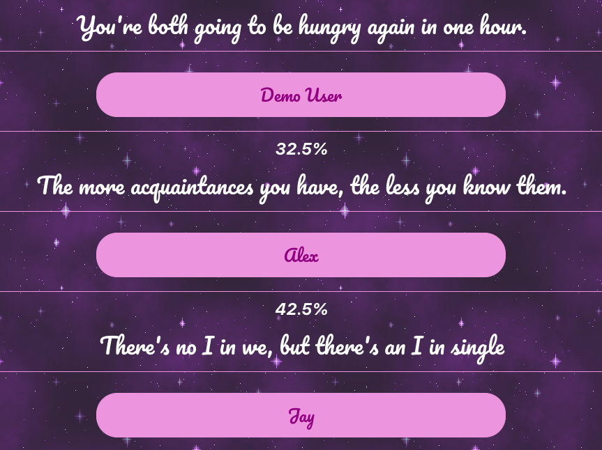

# Fortune Couple App

The [fortune couple app](http://fortune-couple.herokuapp.com/#/), inspired by fortune cookies, is a compatibilty app that generates a fortune base on two users zodiacs, common interests, and their perspective on marriage/children. Similar to actual fortune cookies, the fortunes this app generates are short prophecies that should not be taken too seriously. They are meant to make you think or, even better, chuckle. 

## Code Snippets
The code that makes the fortune couple app a success comes from the calculations
happening under the hood. Here are a few examples of the clean code that powers
this app:

## Fortunes
Here are some examples of the fortunes our app generates, as shown on a users history
page: 

## The Creators
[Ara Cho](https://github.com/aracpyon)
Ara was team lead having a hand in all features of this project. She designed the
layout of the play and results page and, being the artist that she is, she created
the logo for the fortune couple app.

[Phong Ngo](https://github.com/phongngo91)
Phong was the lead backend engineer. Phong spearheaded our search functionality.
He also wrote a lot of the mathematical code for calculating user compatibilty. Phong 
tested each feature as it was completed and made this app smooth and bug free.

[Melody Luo](https://github.com/luomel)
Melody was one of the flex engineers working from end to end. She filled in wherever 
needed contributing to the backend calculations and taking lead on the functionality and
asthetic of the history and splash pages.

[Ja'Lisha Higgs](https://github.com/higgsj82)
Ja'Lisha was another flex engineer who primarily worked on user authentication.
She built the user models and routes on the backend and designed the login and signup 
pages on the frontend. Ja'Lisha also styled the creators page that highlights
our team.

### Helper method to find a zodiac string based on the date string

<https://github.com/aracpyon/fortune-app/blob/master/helpers/zodiac_string_calc.js>